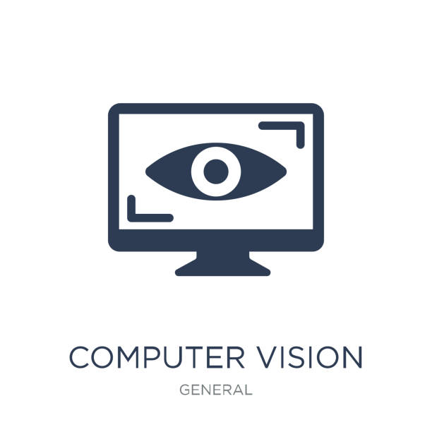

    
    <h1 align="center">here 🛸 Javier Cuenca Gento!</h1>

<h3 align="center">__ <b>Ingeniero de Telecomunicaciones</b> __ 
    
 __ <i>Full-Stack</i> Developer __</h3>

    <h3 align="center">Some projects</h3>
    

        
        
        
    

  

- 🔭 Currently on ionIDe Telematics...
