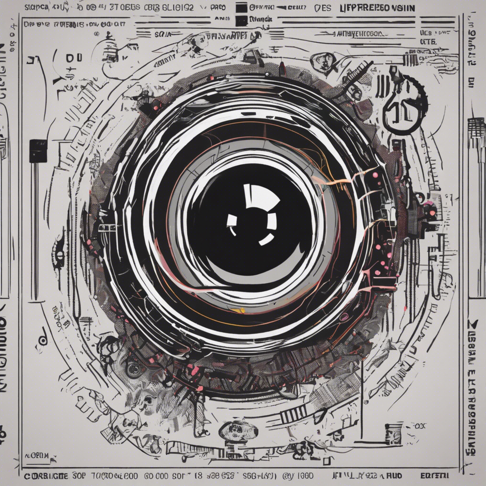

    
    <h1 align="center">here 🛸 Javier Cuenca Gento!</h1>

<h2 align="center"><b>Ingeniero de Telecomunicaciones</b> at 
    
... <i>Full-Stack</i> Developer </h3>

  
  
  

    <h3 align="center">Some projects</h3>
    

        
        
        
        
    

  

- 🔭 Currently @ ionIDe Telematics...

---

## Languages and Tools
<code></code>
<code></code>
<code></code>

---

 

<!-- Profile Views -->

  

